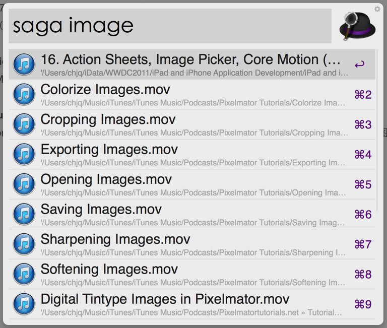
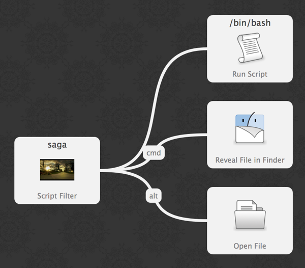

# Play Mdeia
OS X是一个定制化非常强的操作系统，在GUI、程序进程、脚本之间结合的非常精妙，有人说OS X封闭，事实上OS X为用户预留了非常多的入口和切面，让你能够通过简单、简洁的办法进入系统做你想做的事情。

Alfred是OS X最常用的一款增强型工具软件，充分利用了OS X的这些特性，帮助用户通过快捷键完成各种常用操作，属于Mac必备软件。
近期Alfred发布了V2，对原有特性进行了增强和完善，并推出了全新的workflow功能，提供了极为简洁的接口和各种Action，帮助用户定制自己的功能。

Play Mdeia是为Alfred开发的一款workflow，主要功能就是快速定位Mac中的音视频文件，并通过合适的播放器播放。
这个workflow的需求来自于我个人的使用习惯。我是重度Podcast和iTune U用户，在iTunes App
Store上订阅了大量的公开课视频，包括WWDC上近年的视频，有时候我需要快速找到某个主题，打开查看，但是在iTunes找起来非常麻烦，要操作很多步骤。
Alfred本身提供的播放iTunes的功能，也没法满足这个需求，比如你打开Alfred 2的iTunes Mini Player，想查找iTunes
U里的内容是查不到的。而直接使用Alfred的find功能会查出一堆不想干的内容，比如你想查看一个和image处理的视频，结果可能找出了一堆图片、包含image的文件夹、pdf等等。

所以只好写一个，这是Play Mdeia的由来，如果您有类似需求，可以使用。

# Development
Alfred 2的workflow提供了多种实现方式，比如shell、php、perl、python、ruby和applescript，最近使用python比较多，所以使用Python 2.7结合OS X的mdfind命令实现了音视频文件检索的功能。

mdfind是spotlight的命令行实现，功能强大，可以定制各种复杂查询，快速检索，例如这里用到的命令：

	mdfind "kMDItemFSName == '*xcode*'c && ( kMDItemKind == 'MP3*' || kMDItemKind == 'QuickTime*' || kMDItemKind == 'Video Media' ) "

这个命令的含义是检索包含xcode文件名的音视频文件，不区分大小写。

检索完成后通过python组织成Alfred 2能识别的xml格式即可。

然后就是使用Alfred 2提供的Actions完成脚本功能、打开文件、打开文件所在Finder等等，一个插件就完成了。

# Requirements
* Python2.7 （OS X 10.8默认的Python版本）
* Alfred 2（付费版）

# Installation
下载Play Media.alfredworkflow，双击导入Alfred 2即可。

# How to use
* 通过option+space呼出Alfred，输入saga image，就可以看到文件名包含image的音视频，如图所示：  

* 用上下方向键选中需要的文件，回车可以直接打开。对于mkv和wmv等iTunes不能播放的音视频文件，会直接使用系统默认程序打开，比如你安装的射手影音或MPlayerX，其他则采用iTunes打开。
* 用上下方向键选中需要的文件，按住command然后再回车，可以在Finder中打开文件所在的文件夹。
* 在Alfred里定制的操作流图如下：  

